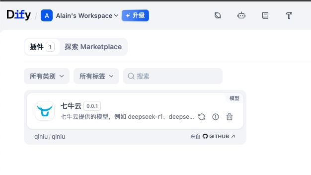
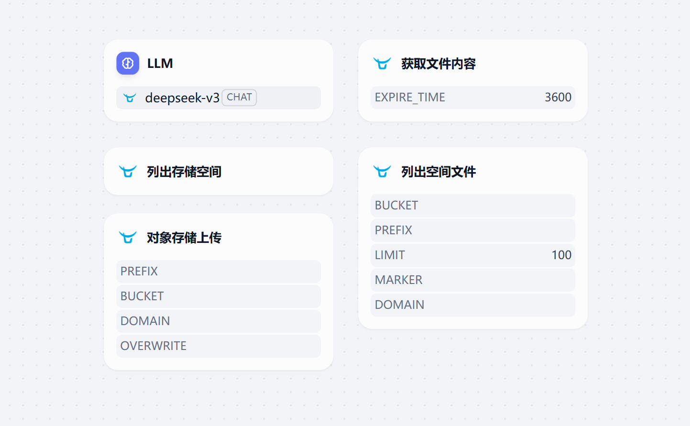
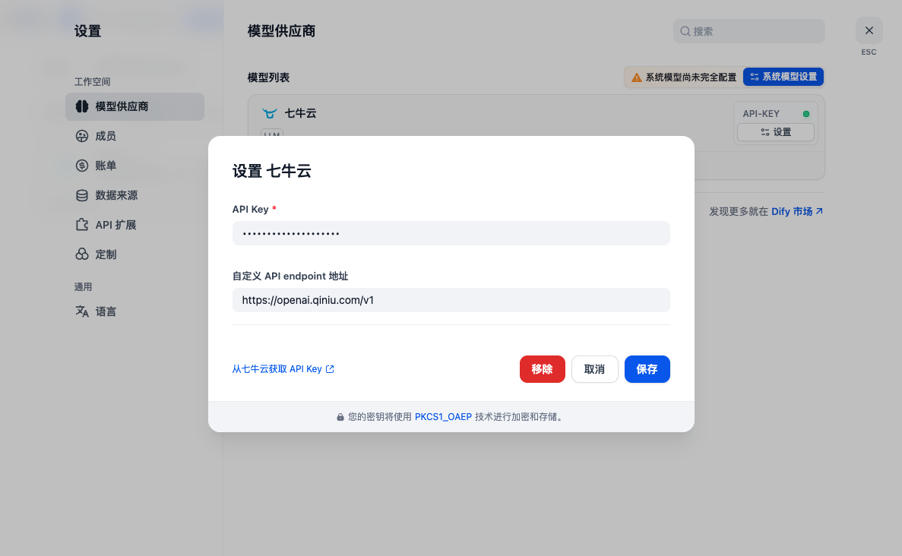

# 七牛云 Dify 插件

七牛云官方的 Dify 插件，为 Dify 平台提供全面的 AI 推理服务和云存储管理功能。支持 Claude 4.x 系列、DeepSeek V3.1、Qwen3 系列、Grok Code 等最新 AI 模型，并提供灵活的包类型选择。

## 📦 仓库信息

- **仓库地址**：[https://github.com/qiniu/dify-plugin](https://github.com/qiniu/dify-plugin)
- **完整功能版本**：通过仓库地址安装可获得包含 AI 推理 + 存储工具的完整功能
- **官方发布**：[Release 页面](https://github.com/qiniu/dify-plugin/releases) 提供离线安装包
- **许可证**：MIT License

> 💡 **提示**：由于 Dify 商店限制，推荐通过仓库地址安装以获得完整功能！



## 功能特性



### 🤖 AI 推理模型供应商

支持多种先进的 AI 大语言模型：

- **OpenAI 开源系列**：GPT-OSS-120b、GPT-OSS-20b
- **DeepSeek 系列**：DeepSeek-R1、DeepSeek-V3、DeepSeek-V3.1（128k上下文）
- **Claude 系列**：Claude 3.5 Sonnet、Claude 3.7 Sonnet、Claude 4.0 Sonnet、Claude 4.5 Sonnet、Claude 4.0 Opus、Claude 4.1 Opus（200k上下文）
- **GLM 系列**：GLM-4.5、GLM-4.5-Air
- **Kimi 系列**：Kimi-K2
- **Qwen 系列**：Qwen-Turbo、Qwen3-32B、Qwen3-235B-A22B（128k上下文）、Qwen3-Max-Preview（256k上下文）
- **Grok 系列**：Grok Code Fast 1（256k上下文，专为代码场景优化）

所有模型均支持智能体思考、工具调用、多工具调用和流式工具调用功能。

### 📁 对象存储工具

提供完整的七牛云存储管理功能：

- **存储空间管理**：列出账户下的所有存储空间
- **文件上传**：支持内容上传，可指定存储空间、文件前缀、自定义域名等
- **文件列表**：支持按前缀过滤、分页查询存储空间中的文件
- **文件内容获取**：通过签名链接获取私有文件内容

## 安装使用

**📍 仓库地址**：[https://github.com/qiniu/dify-plugin](https://github.com/qiniu/dify-plugin)

**重要说明**：由于 Dify 官方商店的设计限制，单个插件不能同时包含AI模型和工具功能（[详见官方说明](https://github.com/langgenius/dify-plugins/issues/1076)），因此我们在商店中分别上架了两个独立的插件。但是，**通过仓库地址安装可以获得包含所有功能的完整版本**。

本插件提供三种不同的包类型：

- **qiniu**：完整功能包，包含 AI 推理和存储工具（**仅支持仓库安装和离线安装**）
- **qiniu-ai**：仅包含 AI 推理模型（支持所有安装方式）
- **qiniu-tools**：仅包含存储管理工具（支持所有安装方式）

### 方式一：通过仓库地址安装（推荐，支持完整功能）

**这是获得完整功能的唯一途径！**

1. 在 Dify 中选择 "Github" 安装方式
2. 输入本仓库地址：`https://github.com/qiniu/dify-plugin`
3. 将获得包含AI推理和存储工具的完整功能包

### 方式二：通过离线安装包安装（推荐，支持完整功能）

1. 在 [Release 页面](https://github.com/qiniu/dify-plugin/releases) 下载对应的离线安装包
   - `qiniu.difypkg`：完整功能包（AI + 存储工具）
   - `qiniu-ai.difypkg`：仅 AI 推理模型
   - `qiniu-tools.difypkg`：仅存储工具
2. 在 Dify 中选择"本地插件"安装方式
3. 上传对应的插件包安装

### 方式三：插件市场安装（功能受限）

> ⚠️ **注意**：由于商店限制，无法提供完整功能包，需要分别安装两个插件

1. 访问 [Dify 插件市场](https://marketplace.dify.ai)
2. 搜索并安装：
   - "Qiniu AI" 或 "七牛云 AI" - 获得AI推理功能
   - "Qiniu Storage Tools" 或 "七牛云存储工具" - 获得存储管理功能
3. 如需完整功能，请选择方式一或方式二

## 配置说明

配置需求取决于你选择的安装方式和功能需求：

### AI 模型配置

**适用于**：

- 通过仓库/离线安装的完整功能包
- 商店安装的 "Qiniu AI" 插件
- 离线安装的 `qiniu-ai.difypkg`

在[模型供应商设置](https://cloud.dify.ai/plugins)页面对 AI 模型进行配置：



**必需配置**：

- **API Key**：在 [七牛云 AI 推理控制台](https://portal.qiniu.com/ai-inference/api-key) 获取

**可选配置**：

- **Custom API endpoint URL**：自定义 API 接口地址
  - 默认：`https://openai.qiniu.com/v1`

### 对象存储工具配置

**适用于**：

- 通过仓库/离线安装的完整功能包
- 商店安装的 "Qiniu Storage Tools" 插件
- 离线安装的 `qiniu-tools.difypkg`

在工具配置页面设置七牛云存储凭证：

**必需配置**：

- **Access Key**：在 [七牛云密钥管理](https://portal.qiniu.com/user/key) 获取
- **Secret Key**：在 [七牛云密钥管理](https://portal.qiniu.com/user/key) 获取

## 开发指南

### 环境要求

- Python 3.11+

### 项目架构

本项目采用模块化架构，支持生成多种包类型：

- **完整包（qiniu）**：包含 AI 推理和存储工具的完整功能
- **AI 包（qiniu-ai）**：仅包含 AI 推理模型供应商
- **工具包（qiniu-tools）**：仅包含存储管理工具

### CI/CD 工作流

项目配置了自动化的 CI/CD 流程：

- **测试工作流**：在每次 push 和 PR 时自动测试所有包类型
- **发布工作流**：标签推送时自动构建并发布三种包类型
- **多 Python 版本支持**：测试 Python 3.11 和 3.12

### 开发步骤

#### 1. 初始化开发环境

```bash
# 创建虚拟环境
python -m venv venv

# 激活虚拟环境
source venv/bin/activate  # macOS/Linux
# 或 venv\Scripts\activate  # Windows

# 安装依赖
pip install -r requirements.txt
```

#### 2. 配置调试环境

1. 在 Dify 中获取远程调试地址和 Key
   - 参考：[Dify 插件调试文档](https://docs.dify.ai/zh-hans/plugins/quick-start/debug-plugin)

2. 复制环境配置文件：

   ```bash
   cp .env.example .env
   ```

3. 编辑 `.env` 文件，填入调试配置：

   ```bash
   INSTALL_METHOD=remote
   REMOTE_INSTALL_URL=debug.dify.ai:5003
   REMOTE_INSTALL_HOST=debug-plugin.dify.dev
   ```

#### 3. 启动插件

```bash
python -m main
```

## 贡献指南

我们欢迎社区贡献！以下是参与贡献的几种方式：

### 🙏 贡献者

感谢所有为这个项目做出贡献的开发者：

<a href="https://github.com/qiniu/dify-plugin/graphs/contributors">
  
</a>

*由 [contrib.rocks](https://contrib.rocks) 自动生成*

### 🐛 报告 Bug

如果你发现了 Bug，请通过以下方式报告：

1. **检查已有 Issues**：在提交新 Issue 前，请先检查 [Issues 页面](https://github.com/qiniu/dify-plugin/issues) 是否已有相关问题
2. **提供详细信息**：报告 Bug 时请包含：
   - 详细的问题描述
   - 复现步骤
   - 预期行为 vs 实际行为
   - 环境信息（操作系统、Python 版本、Dify 版本等）
   - 相关的错误日志或截图

### 💡 功能建议

如果你有新功能的想法：

1. 先在 [Issues](https://github.com/qiniu/dify-plugin/issues) 中搜索是否有类似建议
2. 如果没有，创建新的 Issue 并标记为 `enhancement`
3. 详细描述你的想法和使用场景

### 🛠️ 代码贡献

1. **Fork 此仓库**到你的 GitHub 账户
2. **创建功能分支**：`git checkout -b feature/your-feature-name`
3. **本地开发**：
   - 遵循现有的代码风格
   - 确保你的更改不会破坏现有功能
   - 如果可能，添加相应的测试
4. **提交更改**：
   - 使用清晰、简洁的提交信息
   - 建议使用英文提交信息，格式：`type: description`
   - 示例：`feat: add new model support for GLM-5`
5. **推送分支**：`git push origin feature/your-feature-name`
6. **创建 Pull Request**：
   - 在 PR 描述中详细说明你的更改
   - 如果 PR 解决了某个 Issue，请在描述中引用：`Fixes #issue-number`

### 📝 文档贡献

文档改进同样重要：

- 修正错别字或不准确的信息
- 补充缺失的文档
- 改进文档结构和可读性
- 翻译文档到其他语言

### 🏷️ Issue 标签说明

为了更好地管理 Issues，我们使用以下标签：

- `bug`：确认的 Bug 报告
- `enhancement`：功能增强或新功能请求
- `documentation`：文档相关的改进
- `good first issue`：适合新贡献者的简单问题
- `help wanted`：需要社区帮助的问题
- `question`：使用问题或询问

### 📞 联系方式

如果你有任何问题或建议，可以通过以下方式联系我们：

- 在 GitHub 上创建 [Issue](https://github.com/qiniu/dify-plugin/issues)
- 通过 GitHub Discussions 参与讨论

## 许可证

本项目采用 MIT 开源许可证，具体详情请查看 LICENSE 文件。
