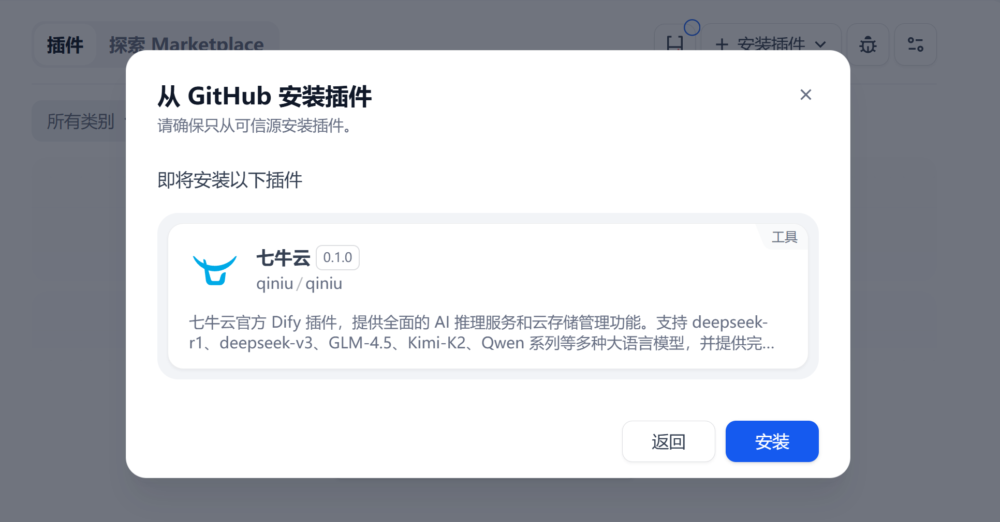

# 七牛云 Dify 插件

七牛云官方的 Dify 插件，为 Dify 平台提供全面的 AI 推理服务和云存储管理功能。



## 功能特性

### 🤖 AI 推理模型供应商

支持多种先进的 AI 大语言模型：

- **DeepSeek 系列**：deepseek-r1、deepseek-v3
- **GLM 系列**：GLM-4.5、GLM-4.5-Air
- **Kimi 系列**：Kimi-K2
- **Qwen 系列**：Qwen-Turbo、Qwen3-32B

### 📁 对象存储工具

提供完整的七牛云存储管理功能：

- **存储空间管理**：列出账户下的所有存储空间
- **文件上传**：支持内容上传，可指定存储空间、文件前缀、自定义域名等
- **文件列表**：支持按前缀过滤、分页查询存储空间中的文件
- **文件内容获取**：通过签名链接获取私有文件内容

## 安装使用

### 方式一：通过仓库地址安装（推荐）

1. 在 Dify 中选择 "Github" 安装方式
2. 输入本仓库地址后提交安装

### 方式二：通过离线安装包安装（推荐）

1. 在 `release` 手动下载离线安装包
2. 在 Dify 中选择"本地插件"安装方式
3. 上传插件包安装

### 方式三：插件市场安装

> 插件市场版本更新没有上述两种版本更新及时

1. 访问 [Dify 插件市场](https://marketplace.dify.ai)
2. 搜索"七牛云"或"Qiniu"
3. 点击安装并按照提示配置

## 配置说明

### AI 模型配置

插件安装后，在[模型供应商设置](https://cloud.dify.ai/plugins)页面对 AI 模型进行配置：


**必需配置**：

- **API Key**：在 [七牛云 AI 推理控制台](https://portal.qiniu.com/ai-inference/api-key) 获取

**可选配置**：

- **Custom API endpoint URL**：自定义 API 接口地址
  - 默认：`https://openai.qiniu.com/v1`

### 对象存储工具配置

在工具配置页面设置七牛云存储凭证：

**必需配置**：

- **Access Key**：在 [七牛云密钥管理](https://portal.qiniu.com/user/key) 获取
- **Secret Key**：在 [七牛云密钥管理](https://portal.qiniu.com/user/key) 获取

## 开发指南

### 环境要求

- Python 3.8+
- dify_plugin >= 0.0.1b22
- qiniu >= 7.12.0
- requests >= 2.25.0

### 开发步骤

#### 1. 初始化开发环境

```bash
# 创建虚拟环境
python -m venv venv

# 激活虚拟环境
source venv/bin/activate  # macOS/Linux
# 或 venv\Scripts\activate  # Windows

# 安装依赖
pip install -r requirements.txt
```

#### 2. 配置调试环境

1. 在 Dify 中获取远程调试地址和 Key
   - 参考：[Dify 插件调试文档](https://docs.dify.ai/zh-hans/plugins/quick-start/debug-plugin)

2. 复制环境配置文件：

   ```bash
   cp .env.example .env
   ```

3. 编辑 `.env` 文件，填入调试配置：

   ```bash
   INSTALL_METHOD=remote
   REMOTE_INSTALL_PORT=5003
   REMOTE_INSTALL_KEY=your-debug-key-here
   REMOTE_INSTALL_HOST=debug-plugin.dify.dev
   ```

#### 3. 启动插件

```bash
python -m main
```

## 许可证

本项目采用 MIT 开源许可证，具体详情请查看 LICENSE 文件。
